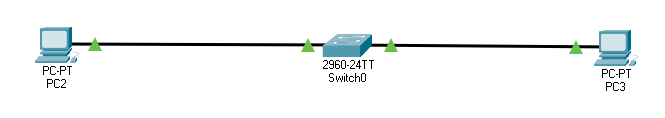

# Network

# Description
Network Components 
1. 2 Host PCs 
2. Switch 
# Configuation
1. Host PCs configured with IPs 10.0.0.1 and 10.0.0.2, SubNetMask is 255.255.255.0 
2. Switch configured to 2 VLANs, for each simulation we change the mapping of the port-VLAN for each computer 
# Simulations 1 - PCs on the same VLAN
1. Configure Switch ports to both be on VLAN 1
2. Run ping from 1 PC to another, make sure it replieas 
3. In this scenarion ping message should arrive since 2 PCs are on the same VLAN
# Simulations 2 - PCs on the same VLAN
1. Configure Switch ports to both be on VLAN 1 and VLAN 2
2. Run ping from 1 PC to another, make sure it doesn't repliea 
3. In this scenarion ping message shouldn't arrive since 2 PCs are on sifferent VLANs
