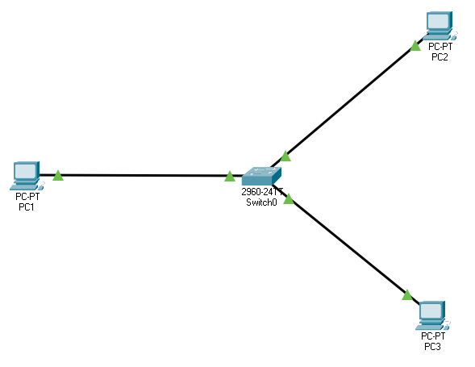
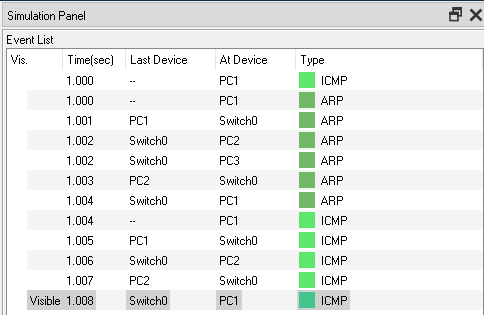
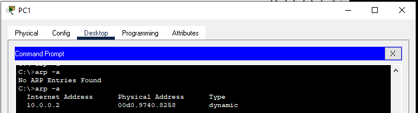
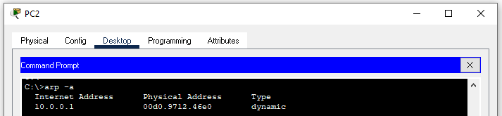
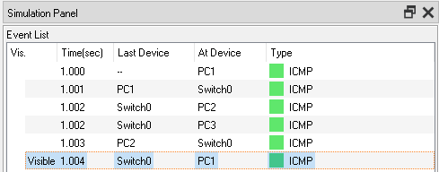
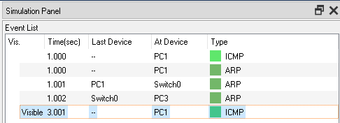
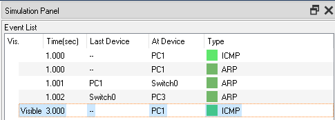

# Network
 
# Description
Network Components 
1. 3 Host PCs 
2. Switch 
# Configuation
1. Host PCs PC1, PC2 and PC3 configured with IPs 10.0.0.1, 10.0.0.2 and 10.0.0.3 respectively, SubNetMask is 255.255.255.0 
2. Switch configured to 2 VLANs, for each simulation we change the mapping of the port-VLAN for each pc 
# Simulations 1 - PCs on the same VLAN
## Test 1 - first message
 
1. Configure Switch ports of all PCs be VLAN1 
2. Run PING from PC1 to PC2, make sure it replieas 
3. In this scenarion ping message should arrive since the two PCs are on the same VLAN 
4. Since ARP Table at PC1 is empty, it first sends ARP to find PC2, switch sends ARP message to all PCs since it doesn't understand IP address 
 
 
5. Note that now both ARP Table of PC1 and PC3 contains IP-MAC of each other 
6. Only PC2 replies 
7. PC1 now sends PING message direcrtly to mac address of PC2 
## Test 2 - not first message
 
1. Sending PING again, doesn't trigger ARP since table is already filled with PC2 MAC address 
# Simulations 2 - PCs on the different VLANs
## Test 1 - first message
 
1. Configure Switch ports of PC1 and PC3 to VLAN1 and PC2 to VLAN2 
2. Run PING from PC1 to PC2, make sure it replieas 
3. In this scenarion ping message shouldn't arrive since the two PCs are on different VLANs 
4. Since ARP Table at PC1 is empty, it first sends ARP to find PC2, switch sends ARP message to all PCs on the same VLAN (in this case only PC3) 
5. Since ARP doesn't find PC2, PING message is not being sent 
## Test 2 - not first message
 
1. Sending PING again, triggers ARP again since ARP Table doesn't contain PC2 MAC address 
