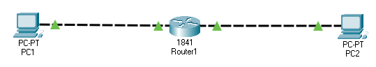
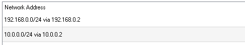
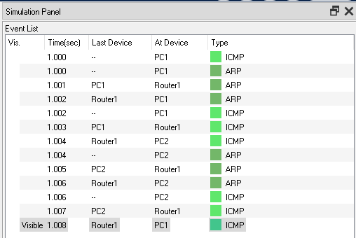

# Network
 
# Description
Network Components 
1. 2 Host PCs 
2. Router 
# Configuation
1. Host PC1 and PC2 configured with IPs 10.0.0.2 and 192.168.0.2 respectively, SubNetMask is 255.255.255.0 
2. Router with 2 IPs for ports with PC1 and PC2 - 10.0.0.1 and 192.168.0.1 respectively, SubNetMask is 255.255.255.0 
3. Host PC1 and PC2 configured with DefaultGateway IPs 10.0.0.1 and 192.168.0.1 respectively 
# Simulations
1. Send PING message from PC1 to PC2 
 
2. Sending PING message shouldn't work since ARP message won't be sent to another subnet 
3. Adding static routing for both directions helps solving this issue 
 
 
4. The message performs the following steps: 
	a. ARP is sent to indentify the DefaultGateway since the destination IP address doesn't belong to the current local network 
	b. PING message is forwarded to the Router 
	c. ARP message is send to indentify PC2 
	d. PING message is forwarded to the PC 
	e. PING response doesn all the way back to PC1 
