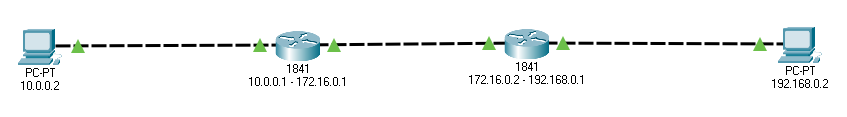
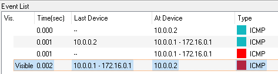
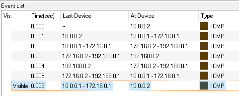
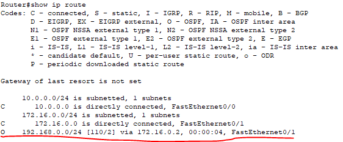

# Network
 

# Description
Network Components 
1. 2 Router 
1. 2 Host PCs 

# Configuation
1. All Routers and Hosts are configured with the show IPs and respective Subnets 

# Simulations 1 - Can't send PING to other subnet
1. Send PING message from 10.0.0.2 to 192.168.0.2 
 
2. The message can't be sent since the router doesn't now how to reach the desired network 

# Simulations 2 - Setting OSPF
1. First we set the OSPF for both Routers 
1. Send PING message from 10.0.0.2 to 192.168.0.2 
 
2. The message reaches the destination since Routers are build up dynamic routing to all networks, after OSPF  
3. Router 10.0.0.1 learns that inroder to reach subnet 192.168.0.0 it needs to send messages through interface f0/1
 

# Config OSPF Commands
1. enable 
2. config terminal 
3. router ospf 10 
4. network 10.0.0.0 0.0.0.255 area 0(example) 
5. passive-interface f0/0 (example) 
6. exit 

# Usefull Commands
1. show ip route 
2. show ip protocols 
3. show ip ospf neighbor 
4. show ip ospf database 
5. show ip ospf database router 
