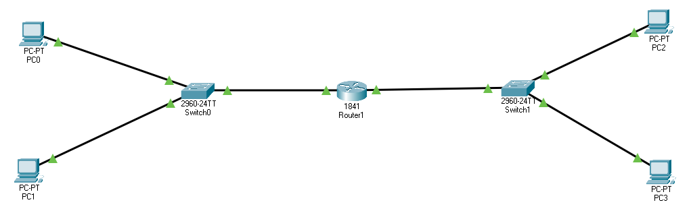
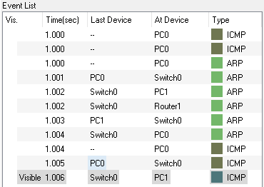
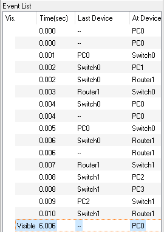
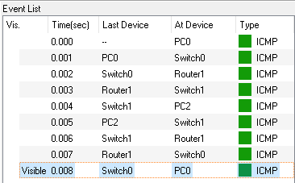
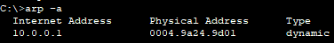

# Network
 

# Description
Network Components 
1. Router 
1. 2 Swtiches, one for earch subnet 
1. 4 Host PCs, 2 for each sunet 

# Configuation
1. Host PC0 and PC1 configured with IPs 10.0.0.2 and 10.0.0.3, SubNetMask is 255.255.255.0, Default GW is 10.0.0.1 
2. Host PC2 and PC3 configured with IPs 192.168.0.2 and 192.168.0.3, SubNetMask is 255.255.255.0, Default GW is 192.168.0.1 
3. Router with 2 IPs for ports with PC1 and PC2 - 10.0.0.1 and 192.168.0.1 respectively, SubNetMask is 255.255.255.0 

# Simulations 1 - Same VNET
1. Send PING message from PC0 to PC1 
 
2. The message performs the following steps: 
	a. PC indentify the destination IP is on the same VNET with source, so it sends ARP message
	b. Switch broadcast the ARP message to all IPs on the same VNET
	c. PC1 respondes to ARP message 
	d. PING message is sent from PC0 to PC1 
	e. PC1 respondes to PING message 

# Simulations 2 - Different VNET - First Ping Fail
1. Send PING message from PC0 to PC2 
 
2. The message performs the following steps: 
	a. ARP is sent to indentify the DefaultGateway since the destination IP address doesn't belong to the current local network 
	b. PING message is forwarded to the Router 
	c. ARP message is send to indentify PC2 
	d. PING Failes due to time out 

# Simulations 3 - Different VNET - Second Ping Success
1. Send PING message from PC0 to PC2 
 
2. The message performs the following steps: 
	a. no need for ARP since ARP table of PC0 is already filled with Default GW Mac Address 
	 
	b. PING message is forwarded to the Router 
	c. no need for ARP since ARP table of the router is already filled with PC2 Mac Address 
	d. PING Success 
