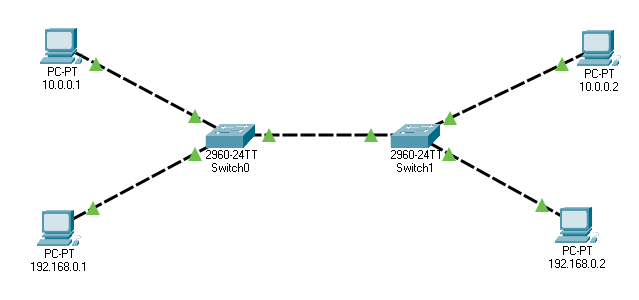
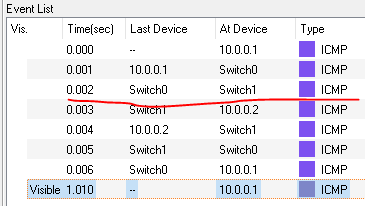
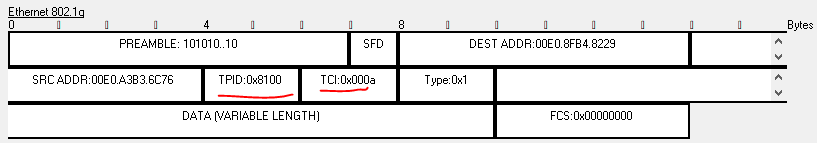

# Network
 

# Description
Network Components 
1. 2 Switches 
1. 4 Host PCs 

# Configuation
1. All Host PCs are configured with the show IPs and respective Subnets 
2. Subnets 10.0.0.0 and 192.168.0.0 are indicated as VLANs 10 and 192 respectively
3. Then interface between 2 Switches configures as Trunk enablined for both virtual networks - 10.0.0.0 and 192.168.0.0 

# Simulations 1 - Send ping through VLAN Trunk Link
1. Send PING message from 10.0.0.1 to 10.0.0.2 
 
2. The message goes trough the Trunk interface between 2 switches 
3. When the frames passes throgh the Trunk interface, it looks like:
 
3. Where the Type is 0x8100 indicating that this is Tag frame, and the VLAN is indicated as 0xa which is the VLAN number of the appropriate VLAN (10)
